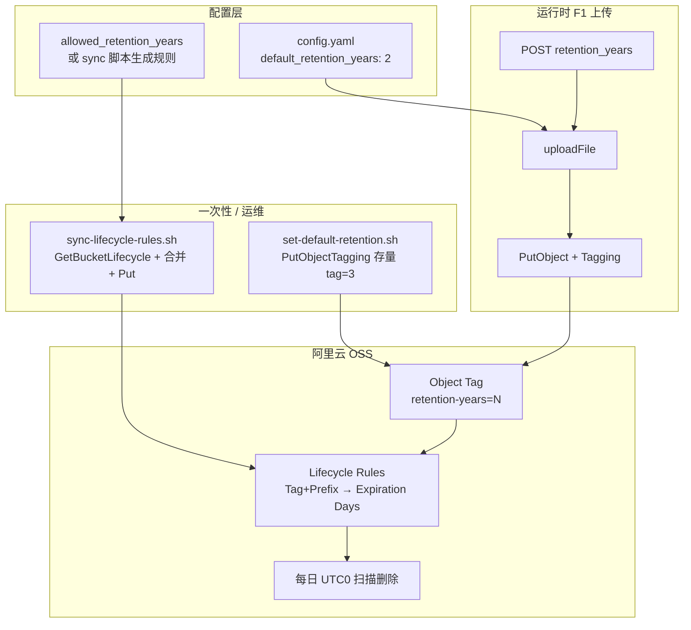

# 架构设计：OSS 文件保存周期（Lifecycle + 对象标签）

> 文档版本：2.0  
> 日期：2026-05-29  
> 状态：设计阶段（基于阿里云 Lifecycle 官方文档修订）  
> 关联：[PRD-RETENTION-PERIOD.md](./PRD-RETENTION-PERIOD.md) · [PLAN-RETENTION-PERIOD.md](./PLAN-RETENTION-PERIOD.md)  
> 参考：[生命周期概述](https://help.aliyun.com/zh/oss/user-guide/overview-54/) · [生命周期配置元素](https://help.aliyun.com/zh/oss/user-guide/configuration-elements)

---

## 目标与约束

| 维度 | 约束 |
|------|------|
| 业务目标 | 为每个 OSS 对象声明保存周期；到期后 **由 OSS 自动删除**，应用不实现删除逻辑 |
| 数据规模 | ~1068 对象、~3.77 GB（现网清单） |
| 架构原则 | 无 DB、无 cron cleanup；与现有单体 + OSS SDK 一致 |
| 默认值 | 配置默认 **2 年**；存量迁移脚本默认 **3 年** |
| 删除责任 | **OSS Lifecycle Expiration**（基于最后一次修改时间 + 天数） |

---

## 现状

| 组件 | 状态 |
|------|------|
| Bucket Lifecycle | **未配置**（inventory 显示「永久保留」） |
| 对象标签 | 上传路径未打 tag |
| `oss-inventory` | 已调用 `GetBucketLifecycle`，可展示规则匹配与预计删除时间 |
| 应用删除 | 仅有 `DELETE /v1/files/:id` 人工/API 删除，无到期自动删 |

---

## 推荐架构（Lifecycle + Tag）

### 核心思路

根据[阿里云生命周期概述](https://help.aliyun.com/zh/oss/user-guide/overview-54/)：

1. **Lifecycle 规则**在 Bucket 级定义「满足条件的 Object → 最后一次修改后 N 天 → Expiration 删除」。
2. **对象标签（Tag）**作为 per-object 策略选择器：上传/迁移时为对象打上 `retention-years=<N>`，Lifecycle 通过 **Prefix + Tag** 筛选命中对应规则。
3. **规则同时作用于存量与新对象**：配置后，存量 Object 按 **LastModified + Days** 计算是否到期（与「存量 3 年自文件日期起算」语义一致）。
4. **应用层不做物理删除**：到期删除、日志（`ExpireObject`）均由 OSS 执行。



### 与官方 Lifecycle 模型的对应

| 官方元素 | 本方案用法 |
|----------|------------|
| **Prefix** | `oss.bucket_prefix`（如 `video_T/`） |
| **Tag** | `retention-years` = `"2"` / `"3"` / `"5"` … |
| **Expiration.Days** | `retention_years × 365`（相对 **Last-Modified-Time**） |
| **Status** | `Enabled` |
| **触发策略** | **最后一次修改时间**（非 Last-Access-Time；后者不支持删除） |

> 参考：[配置元素 — 时间元素 `<Days>`](https://help.aliyun.com/zh/oss/user-guide/configuration-elements)：按最后修改时间 N 天后执行 Expiration。

### 示例 Lifecycle 规则（XML 语义）

```xml
<Rule>
  <ID>retention-years-3</ID>
  <Prefix>video_T/</Prefix>
  <Tag><Key>retention-years</Key><Value>3</Value></Tag>
  <Status>Enabled</Status>
  <Expiration><Days>1095</Days></Expiration>
</Rule>
<Rule>
  <ID>retention-years-2</ID>
  <Prefix>video_T/</Prefix>
  <Tag><Key>retention-years</Key><Value>2</Value></Tag>
  <Status>Enabled</Status>
  <Expiration><Days>730</Days></Expiration>
</Rule>
```

---

## 方案对比（ADR 前置）

| 方案 | 删除执行 | per-object 灵活 | 存量兼容 | 结论 |
|------|----------|-----------------|----------|------|
| **A. Tag + Lifecycle（推荐）** | OSS 自动 | 离散 N 值，每种一条规则 | LastModified 起算 | **采用** |
| B. 仅 Prefix 一条规则 | OSS 自动 | 全员同周期 | ✅ | 不满足前端按文件指定 |
| C. x-oss-meta + 应用 cleanup | 应用 cron | 任意整数 | 需 CopyObject | **废弃**（用户明确不管删除） |
| D. 外部 DB 索引 | 应用或 OSS | 任意 | 双写 | 与无 DB 架构冲突 |

---

## 关键决策（ADR 摘要）

### ADR-1：删除由 OSS Lifecycle 承担，应用零删除逻辑

- **背景**：[生命周期概述](https://help.aliyun.com/zh/oss/user-guide/overview-54/) 明确 Expiration 可在 Last-Modified 后 N 天自动删除；规则对存量、增量 Object 均生效。
- **决策**：不实现 `cleanup-expired`；不在应用内扫描过期对象。
- **后果**：规则创建后 **24 小时内加载**；实际删除在 **次日 UTC 0（北京时间约 8 点后）** 批次执行；`retention_until` 在 API 中为 **预计值**（非精确到秒）。
- **备选**：应用 cron 删除 — 已排除。

### ADR-2：用对象 Tag 选择 Lifecycle 规则，不用 x-oss-meta 驱动删除

- **背景**：Lifecycle 可按 [Tag 筛选](https://help.aliyun.com/zh/oss/user-guide/configuration-elements)；`<Days>` 在规则中固定，**不能**从 tag 动态读取天数。
- **决策**：Tag `retention-years=<N>` 仅作 **规则路由**；每条规则写死 `Days = N × 365`。
- **后果**：`retention_years` 只能是 **已同步 Lifecycle 规则** 的离散值；非法值 API 返回 400。
- **备选**：仅 metadata 声明 — 无法触发 OSS 自动删除。

### ADR-3：存量迁移用 PutObjectTagging，不用 CopyObject

- **背景**：CopyObject 可能改变 LastModified，导致 Lifecycle 起算点漂移；Tagging 不改变对象内容。
- **决策**：迁移脚本 `PutObjectTagging(retention-years=3)`；配合 `sync-lifecycle-rules` 确保存在 `Days=1095` 的规则。
- **后果**：存量 Object 仍按 **原 LastModified + 1095 天** 被 Lifecycle 删除，符合「自文件日期 3 年」。

### ADR-4：PutBucketLifecycle 必须合并现有规则

- **背景**：[概述 — 配置的覆盖机制](https://help.aliyun.com/zh/oss/user-guide/overview-54/)：`PutBucketLifecycle` **全量覆盖** Bucket 上所有规则；只提交新规则会删掉旧规则。
- **决策**：`sync-lifecycle-rules` 流程：`GetBucketLifecycle` → 合并/更新 retention 相关 Rule → `PutBucketLifecycle`（完整列表）。
- **后果**：脚本需保留非本系统创建的规则（按 ID 前缀 `retention-years-` 管理本系统规则）。

### ADR-5：Days 换算与展示分离

- **决策**：Lifecycle `Days = retention_years × 365`；API `retention_until = LastModified.AddDate(years, 0, 0)` 供前端展示。
- **后果**：展示用日历加年 vs OSS 用固定天数，可能有 **1～2 天** 偏差；文档与 inventory 以 Lifecycle 为准。

---

## 风险与缓解

| 风险 | 来源 | 缓解 |
|------|------|------|
| 规则 24h 才生效 | 官方 FAQ | 上线 checklist：先 sync 规则，隔日再验证 |
| Put 覆盖误删其他 Lifecycle | 官方覆盖机制 | Get → merge → Put；dry-run 打印将保留/新增的规则 ID |
| 上传 tag=5 但无对应规则 | Tag 与规则解耦 | 上传前校验 `allowed_retention_years`；sync 脚本保证规则存在 |
| 无 tag 的 Object 永不过期 | 无匹配规则 | 迁移脚本全量打 tag；可选 Prefix 兜底规则（Phase 2） |
| 多规则命中同一 Object | 官方优先级 | 每 Object 仅一个 `retention-years` 值；规则 Tag 互斥 |
| 版本控制 Bucket | 官方说明 | **UNCONFIRMED** 现网是否开启；若开启需额外 NoncurrentVersion 规则 |

---

## 分阶段落地计划

| 阶段 | 交付 | 可逆性 |
|------|------|--------|
| **MVP** | config 默认 2y；sync-lifecycle-rules；上传打 tag；存量 tag=3y；API 返回 retention 字段 | 可改 tag / 改规则 |
| **Should** | oss-inventory 按 tag+规则展示；list 返回 retention | 可逆 |
| **Could** | 无 tag 对象的 Prefix 兜底 Expiration 规则 | 需谨慎前缀范围 |
| **Won't** | 应用侧 cleanup；存储类型 Transition；Last-Access-Time 规则 | — |

---

## 运维 Checklist（生产）

1. **测试 Bucket** 先执行 `sync-lifecycle-rules.sh --dry-run`，再 `--apply`（[官方建议：先测试后部署](https://help.aliyun.com/zh/oss/user-guide/overview-54/)）。
2. 等待 **>24h** 确认规则 Loaded。
3. `set-default-retention.sh --years 3 --dry-run` → 正式执行。
4. 上传测试文件 tag=2，用 inventory 核对「预计删除时间 ≈ LastModified + 730 天」。
5. 确认 Bucket **未误配** 过大 Prefix 的删除规则（避免误删）。

---

## 参考摘录（官方）

- 生命周期规则创建后 **24 小时内** OSS 加载；之后在固定周期（通常 **UTC 0**）扫描执行。
- 规则可基于 **前缀、标签、文件大小** 筛选；**不支持**后缀/通配符/正则。
- **Expiration** 基于 **最后一次修改时间** + `<Days>`；对配置前存量 Object 同样生效。
- 删除操作有 OSS 访问日志：`Operation=ExpireObject`，`Sync Request=lifecycle`。
