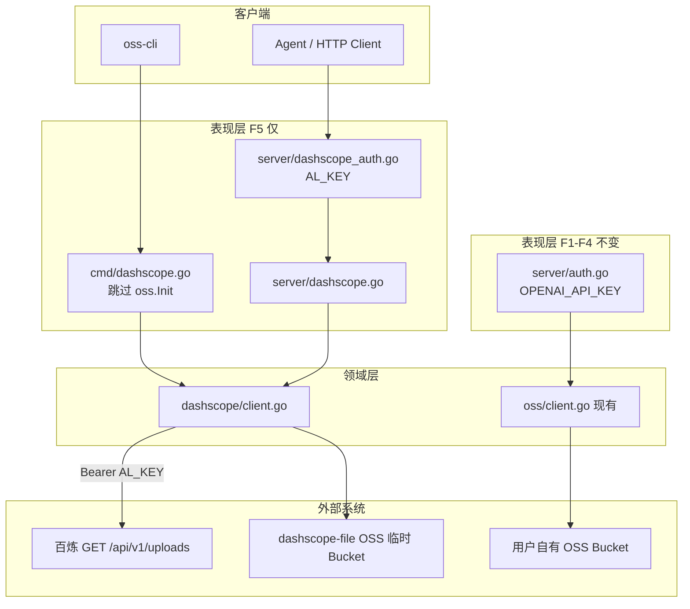
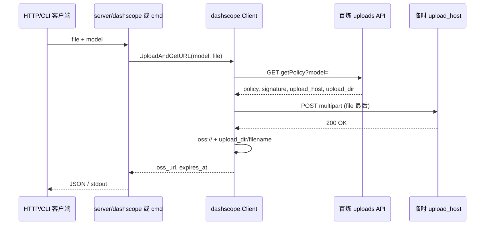

# 架构分析报告：百炼临时文件上传能力

> 文档版本：1.1  
> 日期：2026-05-29  
> 角色：系统架构设计（004）  
> 输入：[PRD-DASHSCOPE-INSTANT-UPLOAD.md](./PRD-DASHSCOPE-INSTANT-UPLOAD.md) · [PLAN-DASHSCOPE-INSTANT-UPLOAD.md](./PLAN-DASHSCOPE-INSTANT-UPLOAD.md) · [ARCHITECTURE.md](./ARCHITECTURE.md)  
> 外部依据：[百炼 — 上传本地文件获取临时 URL](https://help.aliyun.com/zh/model-studio/get-temporary-file-url)

---

## 目标与约束

### 业务目标

为 `alOSS_agent_go` 增加 **F5：百炼临时存储**（**全新功能域**），使 CLI/HTTP 用户完成「本地文件 → `oss://` 临时 URL」。**与 F1–F4 自有 OSS 无重叠**：独立包、独立路由、独立凭证（`AL_KEY`），不扩展 `oss/` 与 `/v1/files`。

### 非功能约束

| 维度 | 约束 | 来源 |
|------|------|------|
| 规模 | 低 QPS、非压测；getPolicy 百炼侧 100 QPS/主账号+模型 | 官方文档 |
| 可用性 | 依赖百炼 uploads API 与临时 OSS 可用性；本服务无状态，可水平扩展 | 现状架构 |
| 延迟 | 两次 HTTP 往返（getPolicy + POST file）；无本地持久化要求 | 数据流 |
| 安全 | 客户百炼 Key 存 `.env.local` 的 **`AL_KEY`**；F5 HTTP 入站 Bearer 与 `AL_KEY` 一致；**不**使用 `OPENAI_API_KEY` | PRD F5-4 v1.1 |
| 合规/运维 | 临时 URL 48h；生产持久文件仍仅走 F1–F4 自有 OSS | 官方 + PRD |
| 技术债边界 | **零改动** `oss/client.go`、`server/auth.go`（OSS 链）、`/v1/files` | ARCHITECTURE.md |

### 团队与复杂度

- 单体、小团队维护（~400 行 server + ~290 行 oss）  
- **默认 YAGNI**：不引入 DB、MQ、DashScope SDK、独立微服务  

---

## 现状

### 已有架构（摘要）

```
客户端 → [CLI | Gin] → server/auth → oss/client → 阿里云自有 Bucket
```

| 能力域 | 路由/命令 | 存储 | URL 形态 |
|--------|-----------|------|----------|
| F1–F4 | `/v1/files`, `oss-cli upload` | 用户配置的 OSS Bucket | HTTPS 签名 `view_url` |
| **缺失 F5** | — | 百炼 `dashscope-instant/*` | `oss://` 前缀，48h |

### 瓶颈与技术债（与本需求相关）

| 项 | 说明 |
|----|------|
| 单一领域包 `oss/` | 仅封装长期 OSS SDK，不宜塞入百炼 HTTP 与 POST 表单上传逻辑 |
| `initConfig` 强制初始化 OSS | **已决策**：`dashscope` 子命令独立 `PreRun`，**跳过** `oss.Init` |
| CORS Allow-Headers | 当前未包含 `X-DashScope-OssResourceResolve`（仅文档场景需要，可选补充） |

### 假设（v1.1）

| ID | 假设 | 状态 |
|----|------|------|
| A1 | 客户百炼 API Key 配置在 `.env.local` 的 **`AL_KEY`** | **已确认** |
| A2 | F5 **不**复用 `OPENAI_API_KEY`、`OSS_ACCESS_KEY_*` | **已确认** |
| A3 | 上传文件大小由百炼 `max_file_size_mb` 约束 | 联调验证 |
| A4 | 模型调用方使用的 `AL_KEY` 与上传时为**同一阿里云主账号** | 官方约束，文档说明 |

---

## 推荐架构（含图）

### 总体：双存储域并行



**原则**：`dashscope/` 与 `oss/` **并列、零 import 交叉**；F5 鉴权走 `dashscope_auth`，**禁止**挂到 F1–F4 的 `AuthMiddleware`。

### 核心数据流（一站式上传）



### 模块边界

| 模块 | 职责 | 禁止 |
|------|------|------|
| `dashscope/types.go` | DTO、JSON 标签与百炼对齐 | 业务编排 |
| `dashscope/client.go` | getPolicy、POST 表单、URL 拼接、重试 | Gin/Cobra 依赖 |
| `server/dashscope.go` | 参数绑定、HTTP 状态码、响应 JSON | 直接拼 multipart 字段 |
| `cmd/dashscope.go` | 标志位、读本地文件、打印结果 | HTTP 服务启动 |

### API 契约（先于实现）

**GET `/v1/dashscope/uploads`**

| 参数 | 必选 | 说明 |
|------|------|------|
| `action` | 是 | 固定 `getPolicy` |
| `model` | 是 | 如 `qwen-vl-plus` |

响应：透传百炼 `request_id` + `data`（snake_case 字段名保持一致）。

**POST `/v1/dashscope/uploads`**

| 字段 | 类型 | 必选 |
|------|------|------|
| `model` | form | 是 |
| `file` | file | 是 |

响应示例：

```json
{
  "oss_url": "oss://dashscope-instant/.../cat.png",
  "expires_at": "2026-05-31T12:00:00Z",
  "model": "qwen-vl-plus",
  "filename": "cat.png"
}
```

**CLI 退出码**：0 成功；1 配置/参数错误；2 百炼/upstream 错误。

### 配置模型（凭证分离）

```bash
# .env.local（推荐，不提交 git）
AL_KEY=sk-xxxxxxxx              # 客户百炼 API Key — F5 唯一上游凭证
OPENAI_API_KEY=...              # 仅 F1–F4 HTTP /v1/files，与 F5 无关
OSS_ACCESS_KEY_ID=...           # 仅 F1–F4 OSS，与 F5 无关
```

```yaml
# config.yaml（可选补充）
dashscope:
  base_url: "https://dashscope.aliyuncs.com"
  default_model: ""              # 可选

server:
  port: 8080
  openai_api_key: "..."          # 仅 /v1/files，不用于 /v1/dashscope/*
```

实现约定：`config.LoadConfig` 增加 `viper.BindEnv("dashscope.api_key", "AL_KEY")`，运行时 `DashScope.APIKey` 来自 `AL_KEY`。

---

## 关键决策（ADR 摘要）

### ADR-001：独立 `dashscope` 包，不扩展 `oss` 包

| 项 | 内容 |
|----|------|
| **背景** | 自有 OSS 与百炼临时存储在凭证、endpoint、URL 语义上完全不同 |
| **决策** | 新增 `dashscope/` 领域包 |
| **后果** | 多一个包维护；边界清晰、可单测、不影响 F1–F4 |
| **备选** | 在 `oss/client.go` 增加 `UploadDashScope` — **否决**（高耦合） |

### ADR-002：HTTP 路径使用 `/v1/dashscope/uploads`，不复用 `/v1/files`

| 项 | 内容 |
|----|------|
| **背景** | OpenAI Files API 语义（list/delete/content）与百炼临时文件不兼容 |
| **决策** | 独立路由组，响应字段 `oss_url` 而非 `view_url` |
| **后果** | 客户端需区分两套 API；避免破坏现有 Agent 集成 |
| **备选** | `POST /v1/files?storage=dashscope` — **否决**（破坏契约、混淆生命周期） |

### ADR-003：F5 统一使用客户 `AL_KEY`（v1.1 修订）

| 项 | 内容 |
|----|------|
| **背景** | F5 为全新功能；百炼要求使用**客户**阿里云百炼 API Key；与 OSS、`OPENAI_API_KEY` 无关 |
| **决策** | 上游与 F5 HTTP 入站均使用 `.env.local` 的 **`AL_KEY`**；F5 专用中间件校验 `Bearer == AL_KEY`；**不复用** `AuthMiddleware` |
| **后果** | 集成方调用 `/v1/dashscope/*` 时 Header 使用与百炼相同的 Key；与 `/v1/files` 的 `OPENAI_API_KEY` 分离 |
| **备选（v1.0 已否决）** | 双 Key（`OPENAI_API_KEY` 入站 + 服务端 `DASHSCOPE_API_KEY`）— 与产品要求不符 |
| **备选（否决）** | 复用 OSS AK 调百炼 — 协议与账号体系均不成立 |

### ADR-004：不引入 DashScope SDK

| 项 | 内容 |
|----|------|
| **背景** | 官方流程仅需 2 次 HTTP + multipart |
| **决策** | 标准库实现 |
| **后果** | 自行维护字段顺序与错误映射；依赖树不变 |
| **备选** | 引入 Java/Python 同款 SDK 的 Go 版 — **无官方 Go SDK 于本场景** |

### ADR-005：policy 过期重试 1 次（同步）

| 项 | 内容 |
|----|------|
| **背景** | `expire_in_seconds` 约 300s，上传慢可能过期 |
| **决策** | 检测 Policy expired 后重新 getPolicy 并上传一次 |
| **后果** | 最坏 4 次 HTTP；实现简单，无后台任务 |
| **备选** | 后台异步重试 — **否决**（过度设计） |

---

## 方案备选对比

| 方案 | 描述 | 优点 | 缺点 | 结论 |
|------|------|------|------|------|
| **A（推荐）** | 独立 `dashscope` 包 + `/v1/dashscope/*` | 边界清晰、可测、可演进 | 多一组 API | **采用** |
| **B** | 纯 CLI，无 HTTP | 实现最快 | Agent 无法统一接入 | 仅作 M1 子集 |
| **C** | 反向代理百炼全路径 | 与官方 1:1 | 难加鉴权、难定制响应 | **否决** |

---

## 风险与缓解

| 风险 | 架构层面缓解 | 可逆性 |
|------|--------------|--------|
| 两套 URL 语义并存 | 文档 + 命名空间 + 响应字段区分 | 可逆 |
| 百炼限流 429 | 文档声明；未来可加 policy 缓存（≤300s） | 可逆 |
| CLI 强依赖 OSS init | `dashscope` 独立 `PreRun`，不调用 `oss.Init` | 已纳入 MVP |
| `AL_KEY` 未配置 | 启动/首次请求时 fail-fast + 文档 | 可逆 |
| multipart 实现错误 | 领域层单测 +  golden file 对比官方 curl | 可逆 |
| 大文件 OOM | `io.Pipe` 流式写入 multipart | 可逆 |

---

## 分阶段落地计划

### MVP（M1–M2）

- `dashscope` 包三函数：`GetUploadPolicy`、`UploadWithPolicy`、`UploadAndGetURL`  
- CLI + HTTP GET/POST  
- 配置项与基础日志  

**不可逆决策**：无（均可回滚删除包与路由）

### 中期

- getPolicy 内存缓存（key: `model`，TTL: `min(expire_in_seconds-30, 270)`）  
- 上传前校验文件大小 ≤ `max_file_size_mb`  
- `dashscope` 子命令可选跳过 OSS `Init`  

### 长期（仅当需求明确）

- 多租户：HTTP Header 映射不同百炼 Key（需密钥管理与审计）  
- 观测：Prometheus 计数 getPolicy/upload 失败率  
- 与 F1–F4 编排（如「先 OSS 再百炼」）— **默认不做**；二者为独立产品能力  

### 对 ARCHITECTURE.md 的增量（实施后）

在 §3 功能架构增加 **F5 百炼临时上传**：

| 功能域 | 能力 | HTTP | CLI |
|--------|------|:----:|:---:|
| **F5 百炼临时** | getPolicy、上传、oss:// URL | `/v1/dashscope/uploads` | `dashscope upload/policy` |

在 §2 分层图增加 `dashscope/client.go` 节点，与 `oss/client.go` 并列连向不同 External。

---

## 与现有能力对照

```
┌─────────────────────────────────────────────────────────────────┐
│                      alOSS_agent_go                             │
│  （同一二进制，两套独立能力，无共享存储/无共享 API Key）            │
├──────────────────────────────┬──────────────────────────────────┤
│ F1–F4 自有 OSS【现有】        │ F5 百炼临时【全新，无重叠】         │
├──────────────────────────────┼──────────────────────────────────┤
│ POST /v1/files               │ GET/POST /v1/dashscope/uploads    │
│ 鉴权：OPENAI_API_KEY         │ 鉴权：AL_KEY（专用中间件）         │
│ 存储：用户 OSS Bucket        │ 存储：百炼 dashscope-instant      │
│ URL：HTTPS 签名 view_url     │ URL：oss:// 前缀，48h             │
│ 凭证：OSS_*                  │ 凭证：.env.local → AL_KEY         │
└──────────────────────────────┴──────────────────────────────────┘
```

**模型调用边界（本服务外）**：调用方在请求百炼时必须带 `X-DashScope-OssResourceResolve: enable`（HTTP）；本服务不负责代理推理。

---

## 结论

推荐采用 **方案 A**：并列 `dashscope/` 包、独立 `/v1/dashscope/*`、**客户 `AL_KEY`** 单凭证模型（v1.1），按 [PLAN-DASHSCOPE-INSTANT-UPLOAD.md](./PLAN-DASHSCOPE-INSTANT-UPLOAD.md) 实施。F5 与 F1–F4 **无功能与配置重叠**，对现有 OSS 链路 **零修改**。

---

## 变更记录

| 版本 | 日期 | 说明 |
|------|------|------|
| 1.0 | 2026-05-29 | 初版架构分析 |
| 1.1 | 2026-05-29 | F5 与 OSS 解耦；ADR-003 修订为 `AL_KEY`；CLI 跳过 oss.Init |
