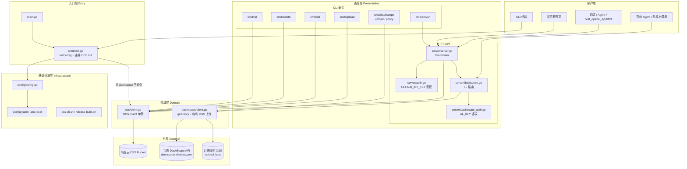
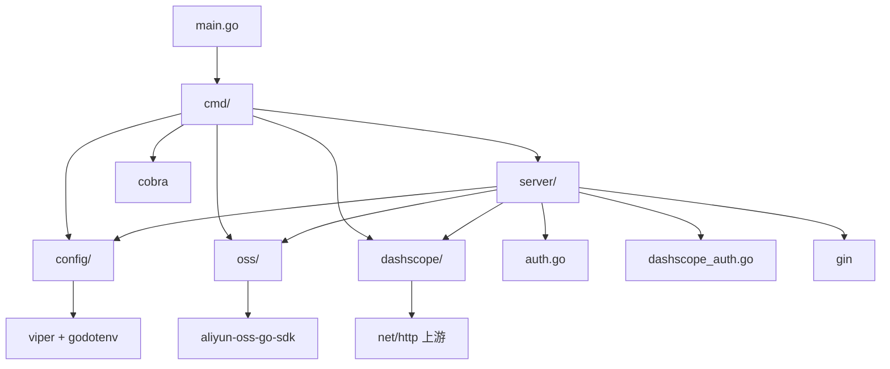
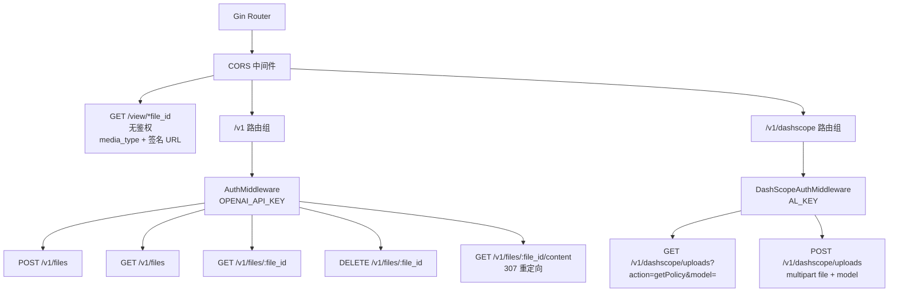
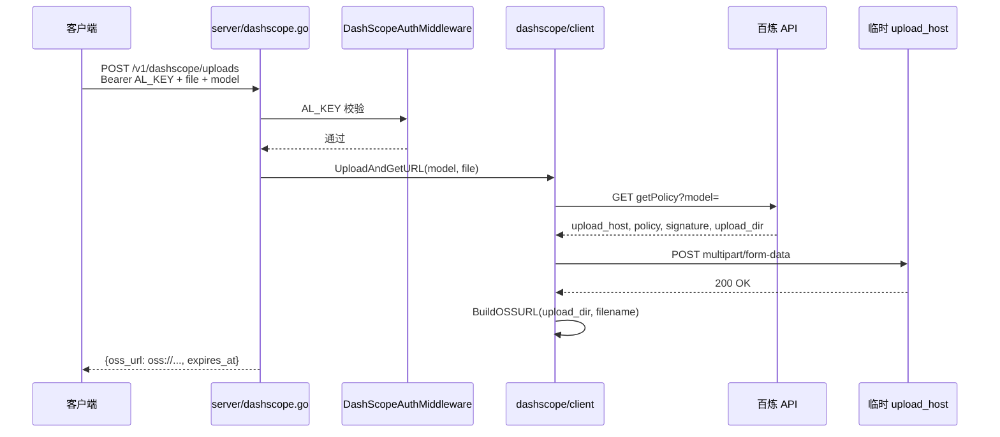
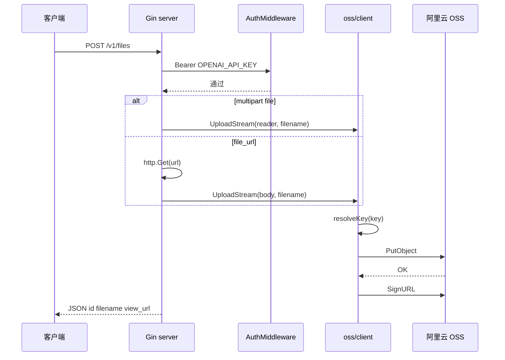
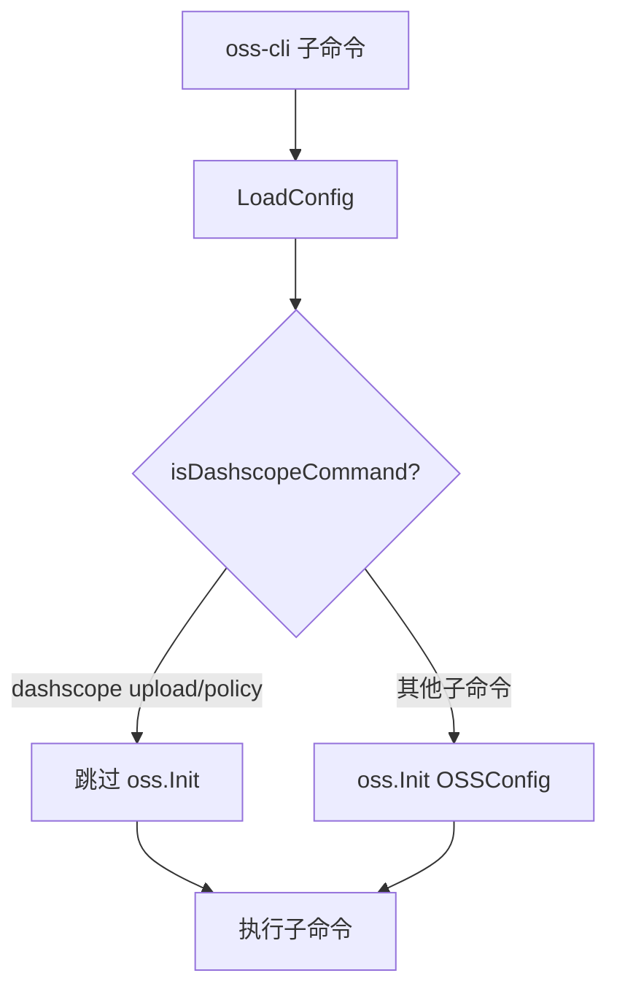

# alOSS_agent_go 架构分析

> 由 `/understand` 工作流重新分析 · 版本 **V1.0.4**  
> Git commit: `ef13658` · 分析日期：2026-05-29  
> 知识图谱：`.understand-anything/knowledge-graph.json`（副本：`docs/knowledge-graph.json`）

---

## 1. 项目定位

**alOSS_agent_go**（模块名 `github.com/derekt/oss-cli`，二进制 `oss-cli`）是兼容 **OpenAI Files API** 的阿里云 OSS 文件管理服务，并在 V1.0.3 新增 **F5 百炼 DashScope 临时文件上传**能力。

| 入口 | 技术 | 场景 |
|------|------|------|
| CLI (`oss-cli`) | Cobra | 脚本、终端、批处理 |
| HTTP API | Gin | 前端、Agent、自动化平台 |

**三条业务线、两套凭证：**

| 功能域 | 凭证 | 返回 URL 形态 |
|--------|------|---------------|
| F1–F4 OSS 文件管理 | `OPENAI_API_KEY` + OSS AK/SK | HTTPS 签名 URL |
| F5 DashScope 临时上传 | `AL_KEY`（百炼 API Key） | `oss://` 协议 URL（48h 有效） |

**核心设计原则：**

- 对外 API 不暴露 OSS 内部前缀（`stripPrefix` / `resolveKey`）
- `/v1/*` 需 Bearer 鉴权；F5 使用独立的 `AL_KEY` 中间件
- `/view/*` 靠签名 URL 时效性保障安全
- F5 与 OSS 领域层完全隔离：`dashscope/` 独立包，不修改 `oss/client.go`
- 无数据库、无消息队列 — 纯 OSS + 百炼 HTTP 的小型单体

---

## 2. 软件架构（分层）

### 2.1 分层总览



### 2.2 包依赖关系



### 2.3 分层职责表

| 层级 | 路径 | 职责 | 关键类型/函数 |
|------|------|------|---------------|
| 入口层 | `main.go`, `cmd/root.go` | 启动、配置初始化、条件 OSS Init | `Execute()`, `initConfig()`, `isDashscopeCommand()` |
| API 层 | `server/server.go` | F1–F4 REST 路由、CORS、OpenAI 兼容响应 | `RunServer()`, `uploadFile()` |
| F5 API 层 | `server/dashscope.go` | 百炼临时上传 HTTP 端点 | `getDashScopeUploadPolicy()`, `postDashScopeUpload()` |
| 安全层 | `server/auth.go`, `server/dashscope_auth.go` | Bearer 鉴权（两套 Key）、IP 黑名单 | `AuthMiddleware()`, `DashScopeAuthMiddleware()` |
| CLI 层 | `cmd/*.go` | 6 组子命令（含 dashscope） | `server`, `upload`, `list`, `delete`, `url`, `dashscope` |
| OSS 领域层 | `oss/client.go` | OSS 操作统一入口 | `UploadFile`, `UploadStream`, `GetSignedURL` |
| DashScope 领域层 | `dashscope/` | getPolicy、multipart 上传到临时 OSS | `Client.GetUploadPolicy`, `UploadAndGetURL` |
| 配置层 | `config/config.go` | 多源配置加载 | `LoadConfig()`, `ValidateDashScopeKey()` |
| 运维脚本 | `oss-cli.sh`, `release-build.sh` | 服务启停、发布打包 | start/stop/status/logs |
| 外部 | 阿里云 OSS / 百炼 API | 对象存储与临时上传 | PutObject, getPolicy, POST upload_host |

---

## 3. 功能架构（业务能力）

### 3.1 功能域地图

```mermaid
flowchart LR
    subgraph F1 [F1 文件上传]
        F1A[表单上传 multipart]
        F1B[URL 离线上传 file_url]
        F1C[CLI 分片上传 100KB×3 并发]
        F1D[HTTP 流式 PutObject]
    end

    subgraph F2 [F2 文件管理]
        F2A[列表]
        F2B[详情]
        F2C[删除]
    end

    subgraph F3 [F3 访问与预览]
        F3A[view_url 签名链接]
        F3B[307 重定向下载]
        F3C[/view 媒体预览]
        F3D[缩略图 w h + webp format]
    end

    subgraph F4 [F4 安全与运维]
        F4A[Bearer OPENAI_API_KEY]
        F4B[IP 黑名单]
        F4C[CORS]
        F4D[oss-cli.sh 服务管理]
    end

    subgraph F5 [F5 百炼临时上传 NEW]
        F5A[getPolicy 获取凭证]
        F5B[multipart 上传临时 OSS]
        F5C[返回 oss:// URL]
        F5D[CLI upload / policy]
    end

    F1 --> OSS[(OSS Bucket)]
    F2 --> OSS
    F3 --> OSS
    F5 --> TEMP[(百炼临时 OSS)]
    F5 --> BAILIAN[(DashScope API)]
```

### 3.2 功能矩阵

| 功能域 | 能力 | HTTP | CLI | 鉴权 | 说明 |
|--------|------|:----:|:---:|:----:|------|
| **F1 上传** | 本地文件、URL 离线、流式 | ✅ | ✅ | OPENAI_API_KEY | CLI 分片并发；HTTP PutObject 流 |
| **F2 查询** | 列表、元数据 | ✅ | ✅ | OPENAI_API_KEY | 默认 limit=100 |
| **F2 删除** | 按 file_id | ✅ | ✅ | OPENAI_API_KEY | |
| **F3 访问** | 签名 URL、307 下载 | ✅ | ✅ | OPENAI_API_KEY | `link_expire_seconds` 可配 |
| **F3 预览** | 图片/视频/音频/PDF | ✅ | — | 无（签名 URL） | `/view/*` |
| **F4 安全** | API Key、IP 封禁 | ✅ | — | — | 5 次失败入 `.blackIP.json` |
| **F5 百炼** | getPolicy、一站式上传 | ✅ | ✅ | **AL_KEY** | 返回 `oss://` 非 HTTPS |
| **部署** | release 打包、服务脚本 | — | ✅ | — | `release-build.sh`, `oss-cli.sh` |

### 3.3 HTTP 路由功能图



---

## 4. 核心数据流

### 4.1 F5 百炼临时上传（HTTP 一站式）



### 4.2 F1 文件上传（HTTP）



### 4.3 CLI 启动与 OSS Init 条件分支



### 4.4 路径前缀策略（F1–F4）

| 阶段 | 函数 | 示例 |
|------|------|------|
| API 传入 | — | `photo.jpg` |
| OSS 存储 | `resolveKey()` | `images_data/photo.jpg` |
| 对外返回 | `stripPrefix()` | `id: photo.jpg` |
| 访问链接 | `GetSignedURL()` | `https://bucket.oss.../images_data/photo.jpg?...` |

---

## 5. 模块与组件清单

### 5.1 Go 源文件（18 个）

```
alOSS_agent_go/
├── main.go                      # 入口 → cmd.Execute()
├── config/config.go             # OSS + Server + DashScope 配置
├── oss/client.go                # OSS 封装（F1–F4，未改动）
├── dashscope/                   # F5 独立领域包
│   ├── client.go                # getPolicy、UploadWithPolicy、UploadAndGetURL
│   ├── types.go                 # PolicyResponse、APIError
│   ├── logger.go                # INFO/DEBUG/ERROR 日志
│   └── client_test.go           # 单元测试
├── server/
│   ├── server.go                # F1–F4 HTTP handlers + 路由
│   ├── auth.go                  # OPENAI_API_KEY + IP 黑名单
│   ├── dashscope.go             # F5 HTTP handlers
│   └── dashscope_auth.go        # AL_KEY 中间件
└── cmd/
    ├── root.go                  # 根命令、initConfig、条件 OSS Init
    ├── server.go                # server 子命令
    ├── upload.go / list.go / delete.go / url.go
    └── dashscope.go             # dashscope upload / policy
```

### 5.2 运维与脚本

| 文件 | 说明 |
|------|------|
| `oss-cli.sh` | start / stop / status / logs [-f] 服务管理 |
| `release-build.sh` | 构建到 `release/{timestamp}_{version}/`，含模板 config |
| `scripts/run-integration-tests.sh` | HTTP + CLI 集成测试（KEEP_FILES 模式） |
| `build.sh` | 跨平台二进制编译 |

### 5.3 配置与凭证

| 配置项 | 来源 | 用途 |
|--------|------|------|
| `server.openai_api_key` | `.env.local` → `OPENAI_API_KEY` | F1–F4 Bearer 鉴权 |
| `oss.*` | `config.yaml` + 环境变量 | OSS 连接 |
| `dashscope.api_key` | `.env.local` → `AL_KEY` | F5 Bearer 鉴权 |
| `dashscope.base_url` | `config.yaml` | 默认 `https://dashscope.aliyuncs.com` |
| `dashscope.default_model` | `config.yaml` | 默认 `qwen-vl-max` |

### 5.4 外部依赖（go.mod）

| 依赖 | 用途 |
|------|------|
| `github.com/gin-gonic/gin` | HTTP 框架 |
| `github.com/spf13/cobra` | CLI 框架 |
| `github.com/spf13/viper` | 配置管理 |
| `github.com/joho/godotenv` | .env.local 加载 |
| `github.com/aliyun/aliyun-oss-go-sdk` | OSS SDK |
| `github.com/google/uuid` | CLI 上传 objectKey 生成 |

---

## 6. 知识图谱统计（V1.0.3）

| 指标 | 数量 |
|------|------|
| 分析文件 | 42（含 Go、配置、文档、脚本） |
| 图谱节点 | 89 |
| 图谱边 | 112 |
| 架构层 | 8 |
| 导览步骤 | 10 |

**节点类型分布：** file 18 · function 42 · config 3 · document 8 · endpoint 8 · service 2 · script 4 · concept 4

**边类型分布：** imports 28 · contains 35 · calls 22 · configures 8 · routes 8 · tested_by 6 · documents 5

---

## 7. 架构特点与约束

| 维度 | 现状 |
|------|------|
| **架构风格** | 单体、分层清晰、双入口 + F5 独立领域包 |
| **凭证隔离** | OSS/F1–F4 与 F5 使用不同 API Key，互不影响 |
| **状态** | 无 DB；IP 黑名单 → `.blackIP.json` |
| **F5 URL 形态** | 仅 `oss://` 协议，供百炼多模态消费；非浏览器 HTTPS |
| **F5 有效期** | 上传后 48 小时（`CalcExpiresAt`） |
| **扩展性** | 水平扩展需共享 OSS；无会话状态 |
| **兼容性** | OpenAI Files API 字段对齐（F1–F4） |
| **规模** | ~18 Go 源文件，适合小团队维护 |

---

## 8. 学习路径（Guided Tour）

| 步骤 | 主题 | 关键文件 |
|:----:|------|----------|
| 1 | 项目概览 | `README.md`, `CHANGELOG.md` |
| 2 | 入口与配置 | `main.go`, `cmd/root.go`, `config/config.go` |
| 3 | OSS 领域核心 | `oss/client.go` |
| 4 | HTTP F1–F4 | `server/server.go`, `server/auth.go` |
| 5 | F5 百炼上传 | `dashscope/client.go`, `server/dashscope.go` |
| 6 | CLI 命令 | `cmd/upload.go`, `cmd/dashscope.go` |
| 7 | 服务部署 | `oss-cli.sh`, `release-build.sh` |
| 8 | 集成测试 | `scripts/run-integration-tests.sh` |
| 9 | 前端联调 | `test_openai_api.html` |
| 10 | 设计文档 | `docs/DESIGN.md`, PRD/PLAN |

---

## 9. V1.0.3 相对 V1.0.1 变更摘要

| 变更 | 说明 |
|------|------|
| 新增 `dashscope/` 包 | F5 独立领域层，不侵入 `oss/client.go` |
| 新增 HTTP 路由 | `/v1/dashscope/uploads`（GET getPolicy / POST 上传） |
| 新增 CLI | `oss-cli dashscope upload|policy --model M --file PATH` |
| 配置扩展 | `DashScopeConfig` + `AL_KEY` 环境变量绑定 |
| 条件 OSS Init | dashscope 子命令跳过 `oss.Init` |
| 运维脚本 | `start.sh` → `oss-cli.sh`；`release-build.sh` 模板化 config |
| 版本 | `VERSION` / CLI → V1.0.3 |

---

## 10. 相关文档

| 文件 | 说明 |
|------|------|
| [DESIGN.md](./DESIGN.md) | 详细设计（API 示例、分片方案） |
| [PRD-DASHSCOPE-INSTANT-UPLOAD.md](./PRD-DASHSCOPE-INSTANT-UPLOAD.md) | 百炼临时上传 PRD |
| [PLAN-DASHSCOPE-INSTANT-UPLOAD.md](./PLAN-DASHSCOPE-INSTANT-UPLOAD.md) | 实施计划 |
| [ARCHITECTURE-ANALYSIS-DASHSCOPE-INSTANT-UPLOAD.md](./ARCHITECTURE-ANALYSIS-DASHSCOPE-INSTANT-UPLOAD.md) | F5 专项架构分析 |
| [knowledge-graph.json](./knowledge-graph.json) | Understand Anything 知识图谱 |
| [../CHANGELOG.md](../CHANGELOG.md) | 版本变更记录 |
| [../README.md](../README.md) | 使用说明与 API 参考 |

---

*生成工具：Understand Anything · 分析日期：2026-05-29 · commit ef13658*
