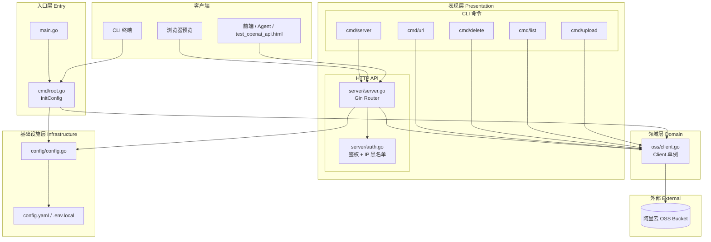
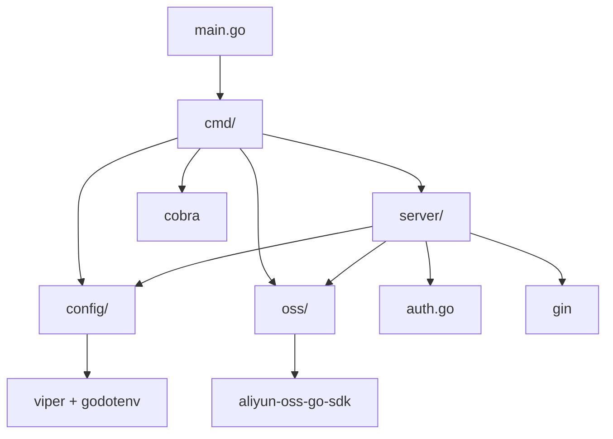
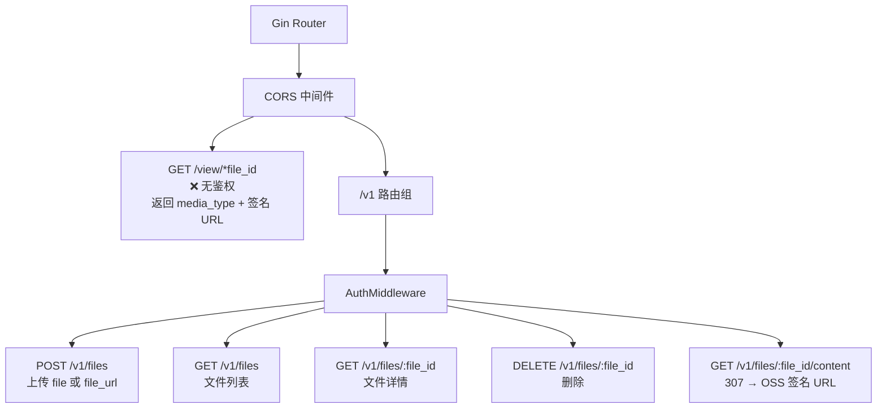
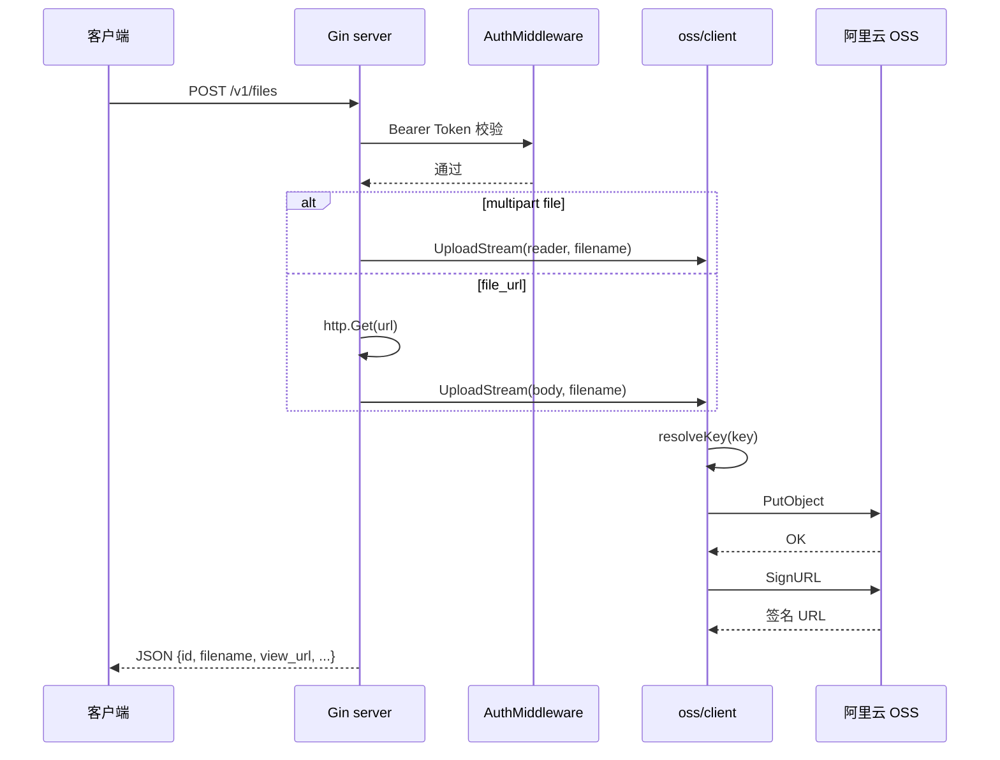
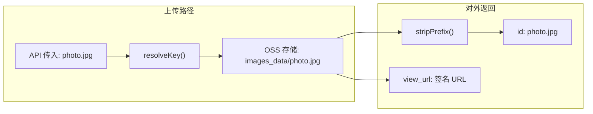
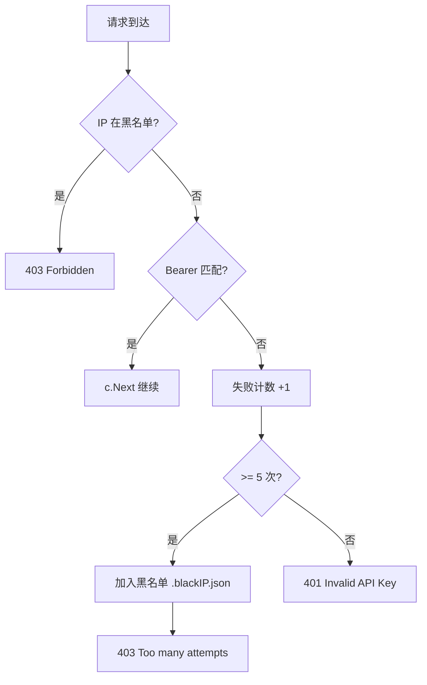
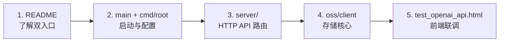

# alOSS_agent_go 架构分析

> 由 `/understand` 工作流生成 · 版本 V1.0.1  
> 知识图谱数据：`docs/knowledge-graph.json`（可用 `/understand-dashboard` 可视化）

---

## 1. 项目定位

**alOSS_agent_go** 是兼容 **OpenAI Files API** 的阿里云 OSS 文件管理服务，提供两条独立入口共享同一 OSS 领域层：

| 入口 | 技术 | 场景 |
|------|------|------|
| CLI (`oss-cli`) | Cobra | 脚本、终端、批处理 |
| HTTP API | Gin | 前端、Agent、自动化平台 |

**核心设计原则：**

- 对外 API 不暴露 OSS 内部前缀（`stripPrefix` / `resolveKey`）
- `/v1/*` 需 Bearer 鉴权；`/view/*` 靠签名 URL 时效性保障安全
- 无数据库、无消息队列 — 纯 OSS 后端的小型单体

---

## 2. 软件架构（分层）

### 2.1 分层总览



### 2.2 包依赖关系



### 2.3 分层职责表

| 层级 | 路径 | 职责 | 关键类型/函数 |
|------|------|------|---------------|
| 入口层 | `main.go`, `cmd/root.go` | 启动、配置初始化 | `Execute()`, `initConfig()` |
| API 层 | `server/` | REST 路由、CORS、OpenAI 兼容响应 | `RunServer()`, `uploadFile()` |
| 安全层 | `server/auth.go` | Bearer 鉴权、IP 黑名单 | `AuthMiddleware()` |
| CLI 层 | `cmd/*.go` | 5 个子命令 | `server`, `upload`, `list`, `delete`, `url` |
| 领域层 | `oss/client.go` | OSS 操作统一入口 | `UploadFile`, `UploadStream`, `GetSignedURL` |
| 配置层 | `config/config.go` | 多源配置加载 | `LoadConfig()` |
| 外部 | 阿里云 OSS | 对象存储 | PutObject, ListObjectsV2, SignURL |

---

## 3. 功能架构（业务能力）

### 3.1 功能域地图

```mermaid
flowchart LR
    subgraph F1 [F1 文件上传]
        F1A[表单上传<br/>multipart]
        F1B[URL 离线上传<br/>file_url]
        F1C[CLI 分片上传<br/>100KB×3 并发]
        F1D[HTTP 流式<br/>PutObject]
    end

    subgraph F2 [F2 文件管理]
        F2A[列表]
        F2B[详情]
        F2C[删除]
    end

    subgraph F3 [F3 访问与预览]
        F3A[view_url 签名链接]
        F3B[307 重定向下载]
        F3C[/view 媒体预览]
        F3D[缩略图 ?w=&h=]
    end

    subgraph F4 [F4 安全与运维]
        F4A[Bearer 鉴权]
        F4B[IP 黑名单]
        F4C[CORS]
        F4D[跨平台二进制]
    end

    F1 --> OSS[(OSS)]
    F2 --> OSS
    F3 --> OSS
```

### 3.2 功能矩阵

| 功能域 | 能力 | HTTP | CLI | 说明 |
|--------|------|:----:|:---:|------|
| **上传** | 本地文件、URL 离线、流式 | ✅ | ✅ | CLI 用分片并发；HTTP 用 PutObject 流 |
| **查询** | 列表、元数据 | ✅ | ✅ | 默认 limit=100 |
| **删除** | 按 file_id | ✅ | ✅ | |
| **访问** | 签名 URL、307 下载 | ✅ | ✅ | `link_expire_seconds` 可配 |
| **预览** | 图片/视频/音频/PDF | ✅ | — | `/view/*` 无鉴权 |
| **安全** | API Key、IP 封禁 | ✅ | — | 5 次失败入黑名单 |
| **部署** | darwin-arm64 / linux-amd64 | — | ✅ | `build.sh`, `start.sh` |

### 3.3 HTTP 路由功能图



---

## 4. 核心数据流

### 4.1 文件上传（HTTP）



### 4.2 路径前缀策略



### 4.3 鉴权与安全流



---

## 5. 模块与组件清单

### 5.1 Go 源文件（11 个）

```
alOSS_agent_go/
├── main.go                 # 入口
├── config/config.go        # 配置
├── oss/client.go           # OSS 封装
├── server/
│   ├── server.go           # HTTP handlers
│   └── auth.go             # 鉴权
└── cmd/
    ├── root.go             # CLI 根
    ├── server.go           # server 子命令
    ├── upload.go
    ├── list.go
    ├── delete.go
    └── url.go
```

### 5.2 外部依赖（go.mod）

| 依赖 | 用途 |
|------|------|
| `github.com/gin-gonic/gin` | HTTP 框架 |
| `github.com/spf13/cobra` | CLI 框架 |
| `github.com/spf13/viper` | 配置管理 |
| `github.com/joho/godotenv` | .env.local 加载 |
| `github.com/aliyun/aliyun-oss-go-sdk` | OSS SDK |
| `github.com/google/uuid` | CLI 上传 objectKey 生成 |

---

## 6. 架构特点与约束

| 维度 | 现状 |
|------|------|
| **架构风格** | 单体、分层清晰、双入口共享领域层 |
| **状态** | 无 DB；IP 黑名单持久化到 `.blackIP.json` |
| **扩展性** | 水平扩展需共享 OSS；无会话状态 |
| **兼容性** | OpenAI Files API 字段对齐 |
| **规模** | ~400 行 server + ~290 行 oss，适合小团队维护 |

---

## 7. 学习路径（Guided Tour）



---

## 8. 相关文档

| 文件 | 说明 |
|------|------|
| [DESIGN.md](./DESIGN.md) | 详细设计（API 示例、分片方案、函数清单） |
| [PRD-DASHSCOPE-INSTANT-UPLOAD.md](./PRD-DASHSCOPE-INSTANT-UPLOAD.md) | 百炼临时上传 PRD（产品需求） |
| [PLAN-DASHSCOPE-INSTANT-UPLOAD.md](./PLAN-DASHSCOPE-INSTANT-UPLOAD.md) | 百炼临时上传实施计划 |
| [ARCHITECTURE-ANALYSIS-DASHSCOPE-INSTANT-UPLOAD.md](./ARCHITECTURE-ANALYSIS-DASHSCOPE-INSTANT-UPLOAD.md) | 百炼临时上传架构分析报告（ADR、数据流） |
| [knowledge-graph.json](./knowledge-graph.json) | Understand Anything 知识图谱 |
| [../README.md](../README.md) | 使用说明与 API 参考 |

---

*生成工具：Understand Anything · 分析日期：2026-05-29*
