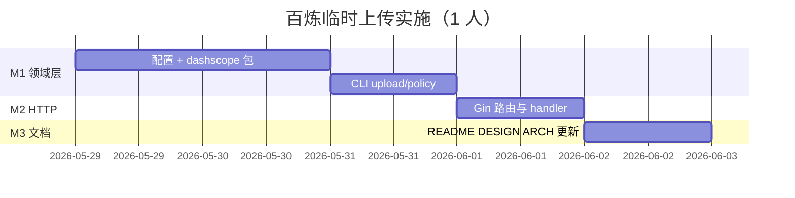
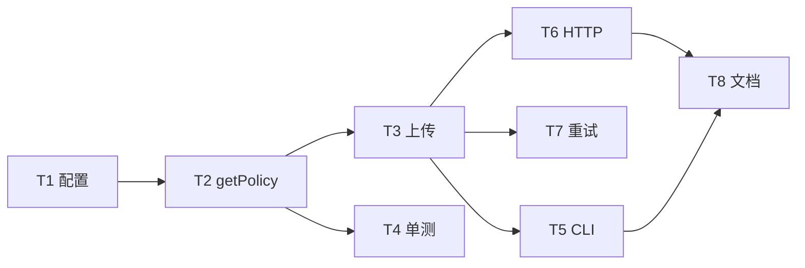

# 实施计划：百炼临时文件上传

> 文档版本：1.1  
> 日期：2026-05-29  
> 估时：约 4–5 人日（1 名 Go 工程师）  
> 关联 PRD：[PRD-DASHSCOPE-INSTANT-UPLOAD.md](./PRD-DASHSCOPE-INSTANT-UPLOAD.md)  
> 关联架构分析：[ARCHITECTURE-ANALYSIS-DASHSCOPE-INSTANT-UPLOAD.md](./ARCHITECTURE-ANALYSIS-DASHSCOPE-INSTANT-UPLOAD.md)

---

## 目标

新增 **F5 百炼临时存储**（**全新功能**，与 F1–F4 OSS **零重叠**）。沿用项目分层习惯，但 **不修改** `oss/client.go`、`/v1/files` 及 `OPENAI_API_KEY` 鉴权链。

**成功标准**

- [ ] `.env.local` 配置 `AL_KEY` 后，CLI/HTTP 可完成 getPolicy + 上传并返回 `oss_url`
- [ ] 仅执行 `oss-cli dashscope *` 时**无需**有效 OSS 配置
- [ ] HTTP F5 路由使用 **F5 专用鉴权**（Bearer = `AL_KEY`），不走 `AuthMiddleware`（`OPENAI_API_KEY`）
- [ ] `go test ./dashscope/...` 通过
- [ ] 文档与 PRD v1.1 一致

---

## 里程碑与时间线



| 里程碑 | 日期（参考） | 交付 |
|--------|--------------|------|
| M1 | D+2 | `dashscope/client.go`、`config` 扩展、CLI |
| M2 | D+3 | HTTP `/v1/dashscope/uploads` |
| M3 | D+4~5 | 文档、可选联调页 |

---

## 任务列表

| ID | 任务 | 估时 | 依赖 | 建议 Skill | 状态 |
|----|------|------|------|------------|------|
| T1 | `DashScopeConfig` + `viper.BindEnv(..., "AL_KEY")` + 启动校验 | 0.5d | — | 005-go-backend-expert | 待办 |
| T2 | `GetUploadPolicy(model)` + 错误映射 | 1d | T1 | 005-go-backend-expert | 待办 |
| T3 | `UploadToInstant(policy, file)` multipart POST | 1d | T2 | 005-go-backend-expert | 待办 |
| T4 | 单元测试：JSON 解析、`BuildOSSURL` | 0.5d | T2 | test-driven-development | 待办 |
| T5 | CLI `dashscope upload` / `dashscope policy` | 0.5d | T3 | 005-go-backend-expert | 待办 |
| T6 | `server/dashscope.go` + 路由 + **F5 鉴权中间件**（`AL_KEY`，非 AuthMiddleware） | 1d | T3 | 005-go-backend-expert | 待办 |
| T6b | `cmd/dashscope` 独立 `PreRun`：仅 LoadConfig + AL_KEY，**跳过 oss.Init** | 0.25d | T1 | 005-go-backend-expert | 待办 |
| T7 | policy 过期自动重试 1 次 | 0.25d | T3 | debugging-and-error-recovery | 待办 |
| T8 | 更新 README / DESIGN / ARCHITECTURE §3 | 0.5d | T6 | documentation-and-adrs | 待办 |

**关键路径**：`T1 → T2 → T3 → T6 → T8`

**可并行**

- T4 与 T3 后期可并行  
- T8 可在 T6 联调通过后启动  

---

## 依赖图



---

## 包与文件清单（预期 diff）

```
alOSS_agent_go/
├── config/config.go              # + DashScopeConfig，BindEnv AL_KEY
├── dashscope/
│   ├── types.go
│   └── client.go                 # 仅依赖 AL_KEY，不 import oss/
├── server/
│   ├── dashscope.go              # HTTP handlers
│   └── dashscope_auth.go         # F5 专用 Bearer 校验（AL_KEY）
├── cmd/
│   └── dashscope.go              # 独立 PreRun，不 Init OSS
└── dashscope/client_test.go

.env.local 示例（F5 必需）：
  AL_KEY=sk-xxxxxxxx   # 客户百炼 API Key
```

**明确不改动**：`oss/client.go`、`server/auth.go`（F1–F4）、`/v1/files` 路由。

**HTTP 路由**

| 方法 | 路径 | 说明 |
|------|------|------|
| GET | `/v1/dashscope/uploads?action=getPolicy&model=` | 获取上传凭证 |
| POST | `/v1/dashscope/uploads` | multipart：`file` + `model`，一站式上传 |

---

## 风险登记册

| 风险 | 概率 | 影响 | 缓解 | Contingency |
|------|------|------|------|-------------|
| 与自有 OSS 概念混淆 | 高 | 中 | 独立路径 `/v1/dashscope/*`，字段用 `oss_url` 非 `view_url` | 文档对比表 |
| getPolicy 100 QPS 限流 | 中 | 高 | 文档限制；不做压测入口 | 后续 policy 缓存 |
| multipart 字段顺序错误 | 中 | 高 | 严格按官方顺序；集成测试 | 对照官方 curl |
| 大文件内存占用 | 低 | 中 | `io.Pipe` + 流式 multipart | 限制 `max_file_size_mb` 前置校验 |
| `AL_KEY` 与 `OPENAI_API_KEY` / OSS 混用 | 高 | 高 | 文档 + F5 独立中间件 + 错误文案 | 配置校验清单 |
| 误用 OSS 凭证调百炼 | 中 | 高 | `dashscope` 包禁止 import `oss` | Code review |

---

## 本周 Now / Next

### Now

1. T1 + T6b：`.env.local` 的 `AL_KEY` 绑定；`dashscope` CLI 跳过 OSS Init  
2. T2–T3：实现 `dashscope` 包（上游 Header 仅用 `AL_KEY`）  

### Next

3. T5：CLI 端到端验证（小图 + `qwen-vl-plus`）  
4. T6–T7：HTTP 与重试  
5. T8：文档与 ARCHITECTURE F5 功能域补充  

---

## 验证清单（发布前）

```bash
# .env.local（勿提交 git）
AL_KEY=sk-xxx

# CLI（无需 OSS 环境变量）
./oss-cli dashscope policy --model qwen-vl-plus
./oss-cli dashscope upload --model qwen-vl-plus --file ./testdata/cat.png

# HTTP（Bearer 必须与 AL_KEY 一致，非 OPENAI_API_KEY）
curl -H "Authorization: Bearer $AL_KEY" \
  "http://localhost:8080/v1/dashscope/uploads?action=getPolicy&model=qwen-vl-plus"

curl -X POST -H "Authorization: Bearer $AL_KEY" \
  -F "model=qwen-vl-plus" -F "file=@./testdata/cat.png" \
  http://localhost:8080/v1/dashscope/uploads
```

模型调用验证（本仓库外；须与上传使用**同一主账号**的 `AL_KEY`）：

```bash
curl -X POST https://dashscope.aliyuncs.com/compatible-mode/v1/chat/completions \
  -H "Authorization: Bearer $AL_KEY" \
  -H "Content-Type: application/json" \
  -H "X-DashScope-OssResourceResolve: enable" \
  -d '{"model":"qwen-vl-plus","messages":[...]}'
```

---

## 变更记录

| 版本 | 日期 | 说明 |
|------|------|------|
| 1.0 | 2026-05-29 | 初稿 |
| 1.1 | 2026-05-29 | F5 与 OSS 解耦；凭证改为 `.env.local` 的 `AL_KEY` |
