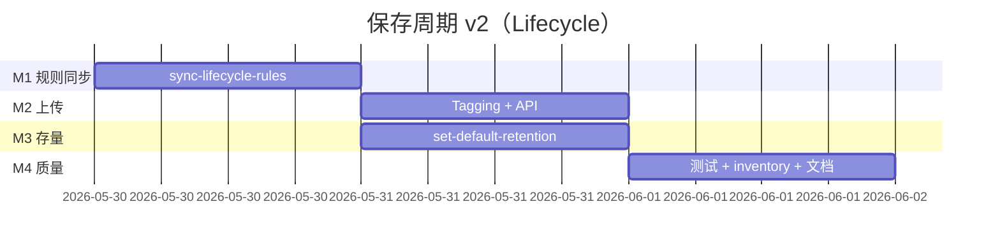
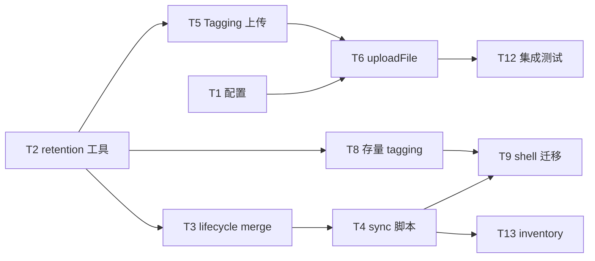

# 实施计划：OSS 文件保存周期（Lifecycle + Tag）

> 文档版本：**2.0**  
> 日期：2026-05-29  
> 估时：约 **3.5–4.5 人日**（1 名 Go 工程师）  
> 关联 PRD：[PRD-RETENTION-PERIOD.md](./PRD-RETENTION-PERIOD.md) v2.0  
> 关联架构：[ARCHITECT-DESIGN-RETENTION-PERIOD.md](./ARCHITECT-DESIGN-RETENTION-PERIOD.md)

---

## 目标

通过 **对象 Tag `retention-years` + Bucket Lifecycle Expiration**，实现 per-object 保存周期；**删除由 OSS 自动执行**，应用不写 cleanup。

**成功标准**

- [ ] `sync-lifecycle-rules.sh` 在测试 Bucket merge 写入规则，且不删除已有非 retention 规则  
- [ ] 无 config 字段时默认 2 年；上传打 tag + 命中 Days=730 规则  
- [ ] `set-default-retention.sh --years 3` 对存量 PutObjectTagging  
- [ ] inventory 显示 Lifecycle 匹配与预计删除时间  
- [ ] 集成测试：上传 tag=2/5、非法值 400  

---

## 里程碑与时间线



| 里程碑 | 工期 | 交付 |
|--------|------|------|
| M1 | D+1 | sync-lifecycle-rules（Get→merge→Put） |
| M2 | D+2 | 上传 Tagging、API retention 字段 |
| M3 | D+2 并行 | 存量 tag=3 脚本 |
| M4 | D+3~4 | 单测、集成、inventory、文档 |

---

## 任务列表

| ID | 任务 | 估时 | 依赖 | Skill | 状态 |
|----|------|------|------|-------|------|
| T1 | `OSSConfig`：`DefaultRetentionYears`、`AllowedRetentionYears` + 默认/normalize | 1.5h | — | 005-go-backend-expert | 待办 |
| T2 | `oss/retention.go`：`TagKey`、`DaysForYears`、`ValidateYears` | 2h | — | 005-go-backend-expert | 待办 |
| T3 | `oss/lifecycle.go`：`BuildRetentionRules`、`MergeLifecycleRules` | 3h | T2 | 004-architect | 待办 |
| T4 | `scripts/sync-lifecycle/main.go` + `sync-lifecycle-rules.sh` | 3h | T3 | 007-docker | 待办 |
| T5 | `UploadStream`/`UploadFile` 增加 `retentionYears` + `Tagging` | 2h | T2 | 005-go-backend-expert | 待办 |
| T6 | `uploadFile` 解析/校验 `retention_years` | 2h | T1,T5 | — | 待办 |
| T7 | `getFileInfo`：`GetObjectTagging` + 计算 `retention_until` | 2h | T2 | — | 待办 |
| T8 | `scripts/set-retention/main.go`：`PutObjectTagging` 分页迁移 | 3h | T2 | — | 待办 |
| T9 | `scripts/set-default-retention.sh` | 1.5h | T4,T8 | — | 待办 |
| T10 | `cmd/upload.go` `--retention-years` | 1h | T5 | — | 待办 |
| T11 | `oss/retention_test.go`、`oss/lifecycle_test.go` | 2h | T2,T3 | TDD | 待办 |
| T12 | 集成测试 + 迁移 dry-run 文档 | 2h | T6,T9 | — | 待办 |
| T13 | `oss-inventory` 优先 tag+规则匹配（复用现有 lifecycle 逻辑） | 2h | T4 | — | 待办 |
| T14 | README、CHANGELOG、config.yaml.example、ARCHITECTURE §3 | 2h | T6 | docs | 待办 |

**关键路径**：`T1 → T2 → T3 → T4 → T5 → T6 → T12`

**上线顺序（运维）**：

1. `sync-lifecycle-rules.sh --apply`  
2. 等待 **24h**（官方规则加载）  
3. `set-default-retention.sh --years 3`  
4. 部署新版本上传服务  

---

## 依赖图



---

## 技术设计摘要

### 1. Lifecycle 规则生成（T3）

```go
func BuildRetentionRule(prefix string, years int) oss.LifecycleRule {
    return oss.LifecycleRule{
        ID:     fmt.Sprintf("retention-years-%d", years),
        Prefix: prefix,
        Status: "Enabled",
        Tags:   []oss.Tag{{Key: "retention-years", Value: strconv.Itoa(years)}},
        Expiration: &oss.LifecycleExpiration{Days: daysForYears(years)},
    }
}

func daysForYears(years int) int { return years * 365 }
```

`MergeLifecycleRules(existing, ours)`：保留 `existing` 中 ID 不以 `retention-years-` 开头的规则；`ours` 按 ID upsert。

### 2. 上传 Tagging（T5）

```go
tagging := oss.Tagging{
    Tags: []oss.Tag{{Key: retention.TagKey, Value: strconv.Itoa(years)}},
}
c.Bucket.PutObject(finalKey, reader, oss.SetTagging(tagging))
```

### 3. 存量迁移（T8）— PutObjectTagging

```go
// 不改变 LastModified，Lifecycle 仍按原文件日期 + Days 删除
bucket.PutObjectTagging(key, oss.Tagging{Tags: []oss.Tag{{Key: "retention-years", Value: "3"}}})
```

### 4. API 校验（T6）

```go
years := config.DefaultRetentionYears()
if s := c.PostForm("retention_years"); s != "" { /* parse */ }
if !config.IsAllowedRetentionYears(years) { return 400 }
if !lifecycleRuleExists(years) { return 503, "lifecycle rule not synced" } // 或 400
```

---

## 风险登记册

| 风险 | 概率 | 影响 | 缓解 |
|------|------|------|------|
| PutBucketLifecycle 覆盖其他规则 | 中 | 高 | Get→merge→Put；dry-run 打印全量 Rule ID |
| 规则未加载即验证删除 | 低 | 中 | 文档强调 24h；集成测试不依赖真实删除 |
| tag 与规则不一致 | 中 | 高 | 上传前校验；迁移前强制 sync |
| 无 tag 对象永不过期 | 中 | 中 | 迁移全量打 tag |
| CopyObject 误用改 LastModified | 低 | 高 | **禁止** CopyObject 迁移，仅 Tagging |

---

## 测试计划

| 用例 | 期望 |
|------|------|
| sync dry-run | 输出将新增/更新的 Rule ID，不调用 Put |
| sync apply + Get | retention-years-2/3/… 存在且 Enabled |
| 上传默认 | tag=2，inventory 显示 730 天规则 |
| 上传 retention_years=5 | tag=5；无规则时 400 |
| 存量 dry-run | 打印 1068 key，无 Tagging 调用 |
| 存量 apply | HeadObject/GetObjectTagging 抽检 tag=3 |

---

## 本周 Now / Next

### Now

1. T2 + T3：规则构建与 merge 单测  
2. T4：测试 Bucket sync dry-run  

### Next

1. T5 + T6 上传链路  
2. T8 + T9 存量迁移（先 dry-run）  
3. T13 inventory 与现网清单对账  

---

## 文档交付

| 文件 | 状态 |
|------|------|
| PRD-RETENTION-PERIOD.md v2 | ✅ |
| PLAN-RETENTION-PERIOD.md v2 | ✅ |
| ARCHITECT-DESIGN-RETENTION-PERIOD.md | ✅ |
| config.yaml.example | 待 T14 |
| README / CHANGELOG | 待 T14 |

---

## 变更记录

| 版本 | 说明 |
|------|------|
| 1.0 | metadata + 应用 cleanup |
| 2.0 | Tag + OSS Lifecycle；移除 cleanup 任务；新增 sync-lifecycle-rules |
