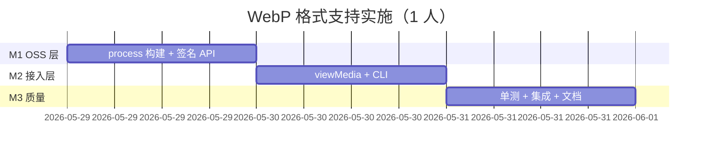
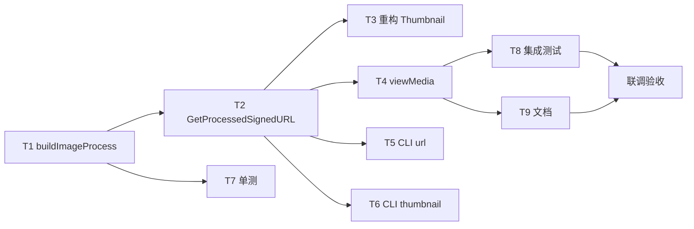

# 实施计划：OSS 标准获取 WebP 格式支持

> 文档版本：1.0  
> 日期：2026-05-29  
> 估时：约 2.5–3 人日（1 名 Go 工程师）  
> 关联 PRD：[PRD-VIEW-WEBP-FORMAT.md](./PRD-VIEW-WEBP-FORMAT.md)  
> 关联架构：[ARCHITECTURE.md](./ARCHITECTURE.md) · [DESIGN.md](./DESIGN.md)

---

## 目标

在 **F3 访问与预览** 中，为 `GET /view/{file_id}` 及 CLI 签名命令增加 **WebP 格式转换** 能力，与现有 `w` / `h` 缩略图参数可组合使用。

**成功标准**

- [ ] `GET /view/photo.jpg?format=webp` 返回含 `image/format,webp` 的签名 URL
- [ ] `GET /view/photo.jpg?w=200&h=100&format=webp` 返回 resize + webp 组合 process
- [ ] 不传 `format` 时行为与现网一致（回归通过）
- [ ] `oss-cli url` / `oss-cli thumbnail` 支持 `--format webp`
- [ ] `go test ./oss/...` process 构建单测通过
- [ ] README / DESIGN / ARCHITECTURE §3.2 已更新

---

## 里程碑与时间线



| 里程碑 | 参考工期 | 交付 |
|--------|----------|------|
| M1 | D+1 | `oss/client.go`：`buildImageProcess`、`GetProcessedSignedURL` |
| M2 | D+2 | `server/viewMedia`、`cmd/url.go` CLI flags |
| M3 | D+3 | 单测、集成脚本、文档、真实 Bucket 联调 |

---

## 任务列表

| ID | 任务 | 估时 | 依赖 | 建议 Skill | 状态 |
|----|------|------|------|------------|------|
| T1 | 实现 `buildImageProcess(w, h, format)` 纯函数 | 2h | — | 005-go-backend-expert | 待办 |
| T2 | 新增 `GetProcessedSignedURL(key, process, expire)` | 2h | T1 | 005-go-backend-expert | 待办 |
| T3 | 重构 `GetThumbnailSignedURL` 调用 T1/T2 | 1h | T2 | code-simplification | 待办 |
| T4 | `viewMedia` 解析 `format=webp` 并分支签名 | 2h | T2 | 005-go-backend-expert | 待办 |
| T5 | `cmd/url.go` 增加 `--format webp` | 1h | T2 | — | 待办 |
| T6 | `cmd/url.go thumbnail` 增加 `--format webp` | 1h | T2 | — | 待办 |
| T7 | `oss/client_test.go` process 字符串单测 | 2h | T1 | test-driven-development | 待办 |
| T8 | `scripts/run-integration-tests.sh` 增加 webp 用例 | 2h | T4 | — | 待办 |
| T9 | 更新 README / DESIGN / ARCHITECTURE F3D | 1h | T4 | documentation-and-adrs | 待办 |
| T10 | CHANGELOG 条目 | 0.5h | T9 | — | 待办 |

**关键路径**：`T1 → T2 → T4 → T8 → 联调验收`

**可并行**

- T5、T6 与 T4 在 T2 完成后可并行  
- T7 与 T3 可并行  
- T9 可在 T4 联调通过后启动  

---

## 依赖图



---

## 技术实现要点

### 1. process 字符串构建（`oss/client.go`）

```go
func buildImageProcess(width, height int, format string) string {
    var parts []string
    if width > 0 && height > 0 {
        parts = append(parts, fmt.Sprintf("resize,w_%d,h_%d,m_fill", width, height))
    }
    if strings.EqualFold(format, "webp") {
        parts = append(parts, "format,webp")
    }
    if len(parts) == 0 {
        return ""
    }
    return "image/" + strings.Join(parts, "/")
}
```

### 2. 签名入口

```go
func (c *Client) GetProcessedSignedURL(objectKey, process string, expiredInSec int) (string, error) {
    finalKey := c.resolveKey(objectKey)
    if process == "" {
        return c.GetSignedURL(objectKey, expiredInSec)
    }
    return c.Bucket.SignURL(finalKey, oss.HTTPGet, int64(expiredInSec), oss.Process(process))
}
```

### 3. `viewMedia` 分支逻辑（`server/server.go`）

```
解析 w, h, format, expire_seconds
    ↓
GetFileInfo 校验文件存在
    ↓
process := buildImageProcess(w, h, format)
    ↓
process != "" → GetProcessedSignedURL
process == "" → GetSignedURL（现网）
    ↓
JSON 响应；若 format=webp 生效则附带 output_format
```

### 4. 涉及文件

| 文件 | 变更类型 |
|------|----------|
| `oss/client.go` | 新增函数 + 重构 thumbnail |
| `oss/client_test.go` | **新建**，process 组合单测 |
| `server/server.go` | `viewMedia` 扩展 |
| `cmd/url.go` | `--format` flag |
| `README.md` | `/view` 参数说明 |
| `docs/DESIGN.md` | F3 预览章节 |
| `docs/ARCHITECTURE.md` | F3D 节点描述 |
| `CHANGELOG.md` | 版本记录 |

---

## 测试计划

### 单元测试（T7）

| 用例 | 输入 | 期望 process |
|------|------|--------------|
| 空 | 0, 0, "" | `""` |
| 仅 webp | 0, 0, "webp" | `image/format,webp` |
| 仅 resize | 200, 100, "" | `image/resize,w_200,h_100,m_fill` |
| resize + webp | 200, 100, "webp" | `image/resize,w_200,h_100,m_fill/format,webp` |
| 大小写 | 0, 0, "WEBP" | `image/format,webp` |

### 集成测试（T8）

| ID | 场景 | 期望 |
|----|------|------|
| H5b | `GET /view/{jpg}?format=webp` | HTTP 200，`url` 含 `format` 相关 process |
| H5c | `GET /view/{jpg}?w=100&h=80&format=webp` | HTTP 200，`url` 含 resize + format |
| H5d | `GET /view/{jpg}` 无 format | 与升级前 URL 结构一致（回归） |

**前置条件**：测试 Bucket 已开通图片处理；未开通时 H5b/H5c 标记 SKIP 并注明原因。

### 联调验收（M6）

1. 浏览器打开 H5b 返回的 `url`，确认 Content-Type 为 `image/webp` 且可展示  
2. 对比同图原图与 WebP URL 的响应体积  
3. CLI：`./oss-cli url test.jpg --format webp` 可访问  

---

## 风险登记册

| 风险 | 概率 | 影响 | 缓解 |
|------|------|------|------|
| Bucket 未开通图片处理 | 中 | 高 | 文档说明；集成测试 SKIP + 启动日志提示 |
| 原图 >16383px 转 WebP 失败 | 低 | 中 | 文档限制；OSS 4xx 由调用方处理 |
| 非图片传 `format=webp` | 中 | 低 | 忽略 format + WARN，不破坏现有调用 |
| SVG 转 WebP 不支持 | 中 | 低 | 文档注明 |
| 前端缓存混用不同 format URL | 低 | 中 | 不同 query 生成不同 URL；文档建议按完整 query 缓存 |

---

## 本周 Now / Next

**Now**

1. T1 + T2：OSS Client 层（可单测、改动面最小）  
2. T4：`viewMedia` 接入（用户可见价值）  

**Next**

3. T5 / T6 CLI 对齐  
4. T7 / T8 测试  
5. T9 / T10 文档与 CHANGELOG  
6. 真实环境 M6 验收  

---

## 变更记录

| 版本 | 日期 | 说明 |
|------|------|------|
| 1.0 | 2026-05-29 | 初稿：WebP 格式支持实施计划 |
